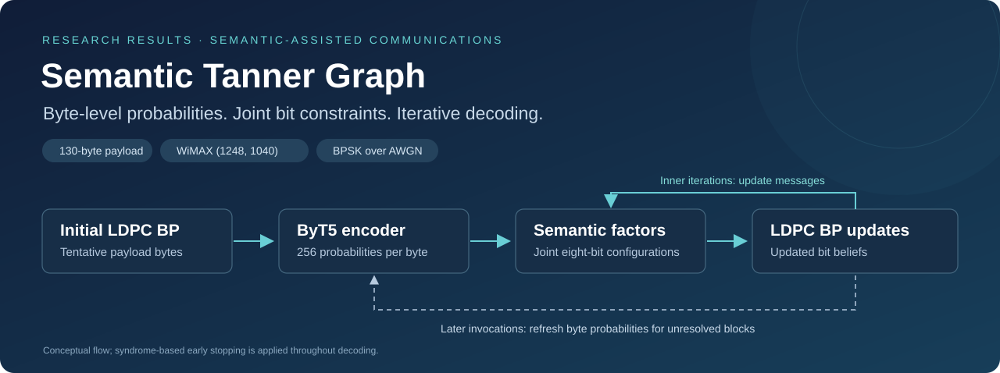

# Semantic Tanner Graph

**Joint byte-level semantic factors for LDPC belief-propagation decoding.**

English · [简体中文](README.zh-CN.md) · [Results & data](reviewer_github_results_20261004/README.md) · [Figure gallery](reviewer_github_results_20261004/FIGURES.md) · [Reviewer guide](reviewer_github_results_20261004/REVIEWER_GUIDE.md)

This repository presents the experimental evidence for **semantic-factor belief propagation (SF-BP)**. A fine-tuned ByT5 encoder estimates a probability distribution over the 256 possible byte values at each payload position. SF-BP represents each distribution as a factor over the corresponding eight information bits and updates its messages using the evolving extrinsic information from the LDPC graph.

**Current release:** experimental settings, numerical results, figures, and measurement records. Implementation, training, evaluation, and benchmark scripts are reserved for release after acceptance; model weights are not included in this results release.

## Explore the evidence

| Question | Start here | Available material |
| :--- | :--- | :--- |
| Does joint semantic feedback improve reliability? | [Error statistics](reviewer_github_results_20261004/03_error_statistics/README.md) | BLER, information-bit BER, ByteER, exact recovery, error counts, confidence sequences |
| How does decoding improve within and between model calls? | [Decoding dynamics](reviewer_github_results_20261004/06_decoding_dynamics/README.md) | Reviewer 3's three figures, message distributions, iteration trajectories, paired refresh study |
| How are the model and its parameters selected? | [Training](reviewer_github_results_20261004/01_data_training/README.md) · [Parameter studies](reviewer_github_results_20261004/02_parameter_studies/README.md) | Data splits, seeds, training history, validation selection, sensitivity sweeps |
| What changes in the decoder's soft information? | [APP-LLR distributions](reviewer_github_results_20261004/05_app_llr/README.md) | Matched-block comparison of BP and one-/six-call SF-BP |
| What does the receiver cost to run? | [Resources & latency](reviewer_github_results_20261004/04_resources_latency/README.md) | Hardware, FLOPs, memory, per-block timing, actual calls, component measurements |

## Reliability at a glance

[Vector PDF](reviewer_github_results_20261004/figures/main_reliability.pdf) · [Numerical data](reviewer_github_results_20261004/03_error_statistics/per_snr_metrics.csv) · [Definitions and stopping rules](reviewer_github_results_20261004/03_error_statistics/README.md)

| Receiver at 4 dB | Transmitted blocks | Block errors | BLER | ByteER |
| :--- | ---: | ---: | ---: | ---: |
| SF-BP | 7,372,800 | 50 | 6.78 × 10⁻⁶ | 7.36 × 10⁻⁷ |
| BM-BP | 1,835,008 | 50 | 2.72 × 10⁻⁵ | 3.48 × 10⁻⁶ |

SF-BP and BM-BP use the same semantic model and matched receiver settings. BM-BP converts the byte posterior to bit-marginal semantic LLRs held fixed within each BP stage; SF-BP instead recomputes joint-factor messages as the other bits' extrinsic beliefs change. Both permit at most six semantic calls per block. The 4-dB counts correspond to an approximately **4.0× lower observed BLER** for SF-BP.

BLER error bars show per-receiver, per-SNR **95% confidence sequences**, not a simultaneous band over all curves. The plotted conventional-BP data come from the SF-BP-paired transmissions; the separate BM-BP-paired BP cohort is retained in the downloadable data. SF-BP and BM-BP high-SNR runs are not mutually paired.

## Inside the iterative decoder

The final error rate is only part of the story. A separate **50,000-block experiment at 2 dB** follows how bit decisions and message distributions evolve through the entire decoding process.

[Vector PDF](reviewer_github_results_20261004/06_decoding_dynamics/overall_error_evolution.pdf) · [Trajectory data](reviewer_github_results_20261004/06_decoding_dynamics/error_evolution.csv) · [All three Reviewer 3 figures](reviewer_github_results_20261004/06_decoding_dynamics/README.md)

During the first assisted stage, BLER decreases from **0.98986** after one inner iteration to **0.06426** at the stage endpoint, even though the ByT5 probabilities remain fixed during that stage. With a maximum of six calls, the same cohort reaches **0.00884**. Inner iterations update the semantic messages; later model invocations refresh the byte probabilities.

<b>See the message distributions: inner iterations and outer invocation budgets</b>

### Fixed probabilities, changing messages

[Vector PDF](reviewer_github_results_20261004/06_decoding_dynamics/inner_message_densities.pdf) · [Histogram data](reviewer_github_results_20261004/06_decoding_dynamics/inner_density_bins.csv)

### Refreshed probabilities, smaller residual-error tails

[Vector PDF](reviewer_github_results_20261004/06_decoding_dynamics/outer_message_densities.pdf) · [Histogram data](reviewer_github_results_20261004/06_decoding_dynamics/outer_density_bins.csv)

Positive truth-aligned LLRs support the transmitted bit. Later calls mainly reduce the remaining negative tail; the main peaks need not move monotonically. These are **finite-length empirical probability densities**, not theoretical density-evolution predictions. Every outer-budget curve retains all 50,000 blocks, including terminal states of blocks that stopped earlier. [Read the measurement definitions.](reviewer_github_results_20261004/06_decoding_dynamics/README.md)

## Parameter selection and robustness

[Vector PDF](reviewer_github_results_20261004/figures/parameter_sensitivity.pdf) · [Calibration and sensitivity data](reviewer_github_results_20261004/02_parameter_studies/README.md)

The checkpoint, **T = 1.3**, and **α = 0.8** are selected on validation data and fixed before test evaluation. The plots show one-parameter-at-a-time test sweeps, not a retuning of the receiver. Each sweep uses identical ordered transmissions across its settings and its own common-prefix length.

## Resources and practical cost

[Vector PDF](reviewer_github_results_20261004/figures/latency_calls.pdf) · [Timing, memory, FLOPs, and hardware details](reviewer_github_results_20261004/04_resources_latency/README.md)

The resource study measures **218,034,560 parameters**, **60.36 GFLOPs of dominant matrix operations per model call**, and **878.24 MiB peak allocated tensor memory** in the specified FP32 inference experiment. End-to-end latency is measured separately on an RTX 3060, with 4,000 distinct received blocks per SNR and three timing passes. Repeated timings are not additional independent transmissions; syndrome-based stopping often avoids unnecessary model calls.

## Experimental setting

| Item | Main configuration |
| :--- | :--- |
| Source block | 130 ASCII bytes / 1,040 information bits |
| Channel code | WiMAX LDPC (1,248, 1,040), nominal rate 5/6 |
| Channel | Unit-energy BPSK over real AWGN |
| SNR convention | 10 log₁₀(1/σ²), equivalent to 10 log₁₀(2 Eₛ/N₀) |
| Semantic predictor | Fine-tuned ByT5-small encoder with a 256-class byte classifier |
| Main receiver settings | T = 1.3, α = 0.8; up to 6 semantic calls; up to 50 BP iterations per stage |
| Correct recovery | Exact equality of all 130 transmitted payload bytes; zero syndrome alone is not success |

<b>Download, file formats, and release scope</b>

- **Browse first:** the [results index](reviewer_github_results_20261004/README.md) and [figure gallery](reviewer_github_results_20261004/FIGURES.md) connect every figure to its data.
- **Download everything:** use GitHub's **Code → Download ZIP**, then open the six numbered sections under `reviewer_github_results_20261004/`.
- **Inspect exact values:** CSV files provide numeric tables; JSON summaries retain counts, stopping rules, intervals, and run settings. The large per-block timing table is compressed as CSV.gz.
- **Inspect publication figures:** PNG previews are accompanied by vector PDFs. Newly drawn overview charts use the existing numerical data; the four response figures are preserved as supplied.
- **Verify the files:** [SHA256SUMS](reviewer_github_results_20261004/SHA256SUMS) covers the results directory; [figure sources](reviewer_github_results_20261004/figure_sources.json) identify each plot's inputs.
- **Release boundary:** this is a results-and-documentation release. It does not include receiver implementation, training/evaluation/benchmark scripts, private source texts, model checkpoints, API credentials, or the full unpublished manuscript and review correspondence.

Questions about a plotted result can be raised through [repository issues](https://github.com/Wenjing79/Semantic-Tanner-Graph/issues). Please identify the figure or data filename and the SNR of interest.
