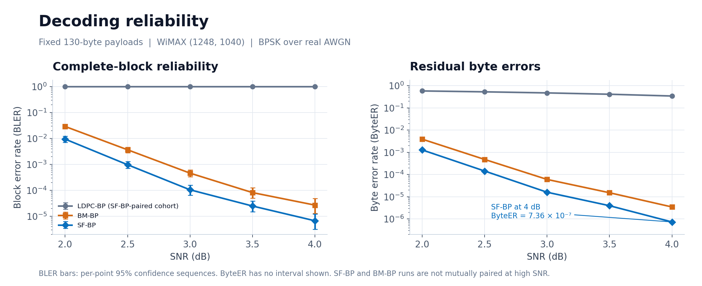
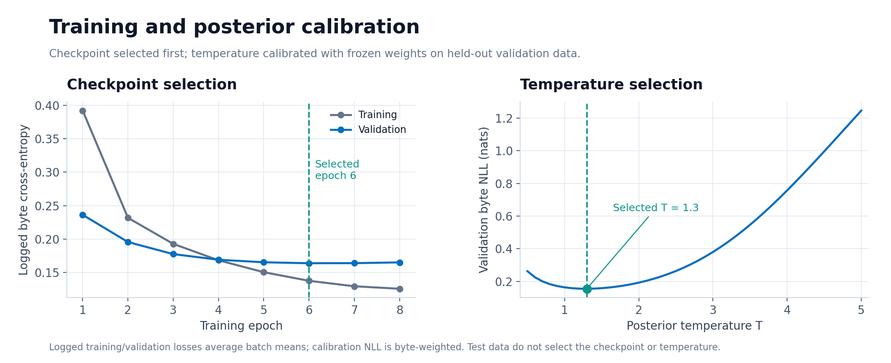
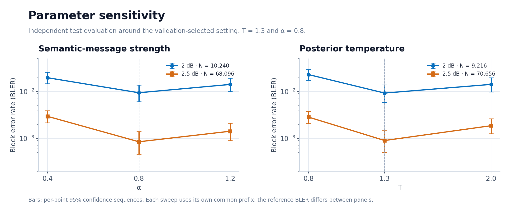
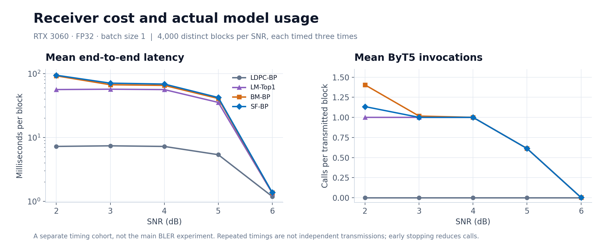
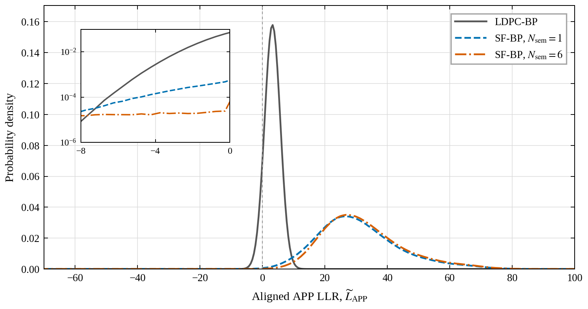
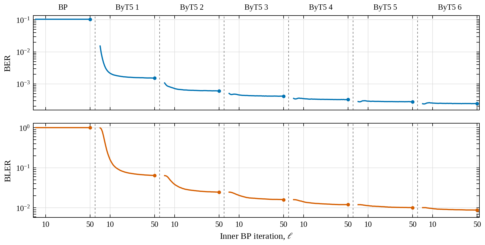
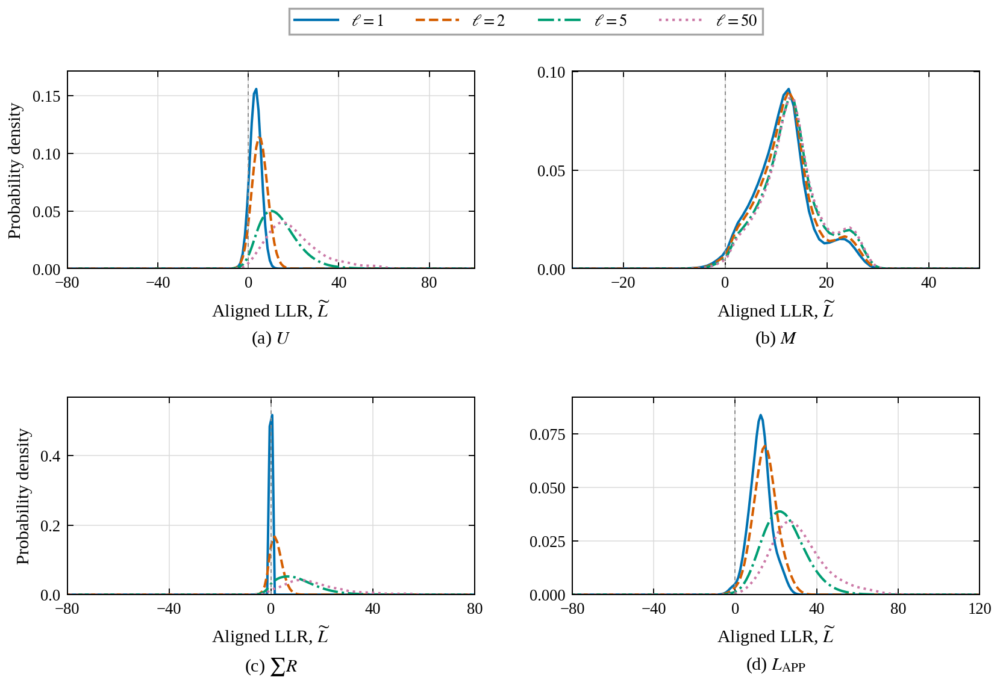
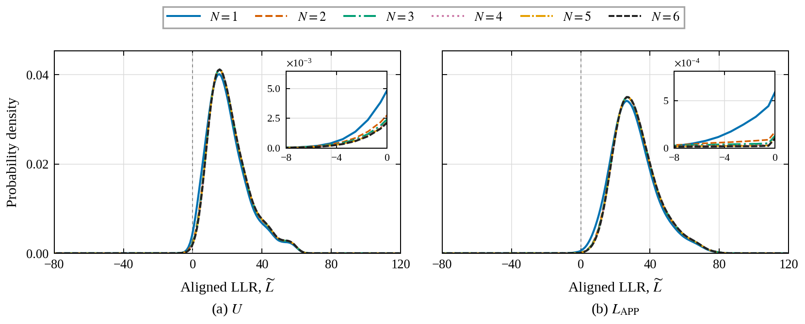

# Figure gallery

[Project overview](../README.md) · [Results index](README.md) · [Reviewer guide](REVIEWER_GUIDE.md)

Every panel below links to a vector PDF, its numerical data, and an explanation. The four response figures are preserved from their publication exports; the four overview figures visualize the existing released CSVs. No new simulation or model inference is used to produce this gallery.

## 1. Main reliability

SF-BP, BM-BP, and the conventional-BP cohort paired with SF-BP. The two BP cohorts remain separate in the CSV; the main-curve experiments use SNR-specific stopping rules.

[PDF](figures/main_reliability.pdf) · [CSV](03_error_statistics/per_snr_metrics.csv) · [Explanation](03_error_statistics/README.md)

## 2. Training and calibration

The minimum logged validation loss selects epoch 6. Frozen-checkpoint validation calibration selects T = 1.3. The plotted losses have different aggregation definitions, described in the methods.

[PDF](figures/training_calibration.pdf) · [Training data](01_data_training/training_history.csv) · [Calibration data](02_parameter_studies/validation_temperature.csv) · [Explanation](01_data_training/README.md)

## 3. Parameter sensitivity

Each sweep uses the same ordered transmissions across parameter settings, but the two sweeps have different common-prefix lengths. The validation-selected parameters are not reselected on test data.

[PDF](figures/parameter_sensitivity.pdf) · [Alpha data](02_parameter_studies/sensitivity_alpha.csv) · [Temperature data](02_parameter_studies/sensitivity_temperature.csv) · [Explanation](02_parameter_studies/README.md)

## 4. Latency and actual semantic calls

RTX 3060, FP32, batch size one; 4,000 distinct blocks per SNR with three repeated timing passes. Timings are a separate cohort from the primary error-rate experiment.

[PDF](figures/latency_calls.pdf) · [Summary CSV](04_resources_latency/latency_summary.csv) · [Per-block CSV.gz](04_resources_latency/per_block_latency.csv.gz) · [Explanation](04_resources_latency/README.md)

## 5. APP distributions with and without semantic assistance

Reviewer 1, Comment 2. All curves use the same 50,000 received blocks at 2 dB and 52 million information-bit observations. The sign-aligned negative mass falls from 10.3705% for BP to 0.1522% and 0.02436% for one-/six-call SF-BP.

[PDF](figures/bp_sfbp_app_densities.pdf) · [Density CSV](05_app_llr/app_density_bins.csv) · [Terminal counts](05_app_llr/terminal_metrics.csv) · [Explanation](05_app_llr/README.md)

## 6. R3-1 — BER and BLER throughout decoding

Reviewer 3, Comment 3. Dashed separators distinguish the initial BP stage and subsequent semantic-assisted stages. The horizontal axis is an iteration budget, not elapsed time.

[PDF](06_decoding_dynamics/overall_error_evolution.pdf) · [Trajectory CSV](06_decoding_dynamics/error_evolution.csv) · [Explanation](06_decoding_dynamics/README.md)

## 7. R3-2 — Inner-iteration message distributions

Reviewer 3, Comment 3. ByT5 probabilities remain fixed within this stage, but semantic messages change as extrinsic inputs evolve. The semantic panel displays the raw log-ratio, before injection scaling and damping.

[PDF](06_decoding_dynamics/inner_message_densities.pdf) · [Density CSV](06_decoding_dynamics/inner_density_bins.csv) · [Exact statistics](06_decoding_dynamics/inner_density_statistics.csv) · [Explanation](06_decoding_dynamics/README.md)

## 8. R3-3 — Outer-invocation message distributions

Reviewer 3, Comment 3. All curves retain the same 50,000 blocks, including early-stopped terminal states. Later calls reduce the negative tail; the main density peaks need not move monotonically.

[PDF](06_decoding_dynamics/outer_message_densities.pdf) · [Density CSV](06_decoding_dynamics/outer_density_bins.csv) · [Terminal statistics](06_decoding_dynamics/fixed_cohort_terminal_statistics.csv) · [Explanation](06_decoding_dynamics/README.md)

**PDF has two meanings here:** density plots show empirical *probability density functions*; their downloadable `.pdf` files are the vector document format. These plots describe finite-length simulations, not theoretical infinite-length density evolution.
